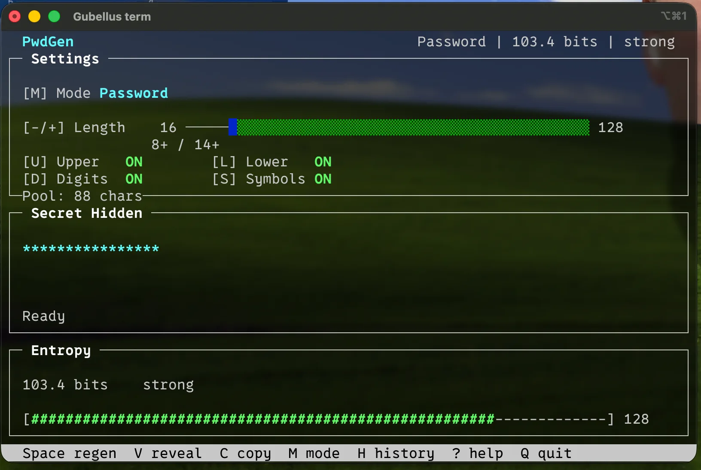

# PwdGen : un générateur de mot de passe en TUI, parce que pourquoi pas

Qui n'a jamais rêvé d'avoir son propre générateur de mot de passe en TUI ? Quoi, personne ? Honnêtement moi non plus, je ne sais pas vraiment d'où cette idée m'a traversé la tête. Je ne l'ai d'ailleurs jamais vraiment utilisé depuis, mais ce n'était pas tellement le but.

L'idée de PwdGen, c'était surtout de découvrir un truc que je connaissais assez peu : les TUI, donc les interfaces graphiques qui tournent directement dans un terminal.

Pour ça, le projet utilise ncurses, une librairie C qui permet de transformer un terminal classique en petite interface interactive avec des fenêtres, des couleurs, des raccourcis clavier, etc. C'est un monde que je connaissais surtout de loin, avec des outils comme htop, et j'avais envie de voir un peu comment ça fonctionnait derrière.

Et autant être transparent : l'idée du projet vient de moi, mais le code a été fait en grande partie avec l'aide de l'IA. Le but n'était pas spécialement de passer des heures à apprendre toute l'API de ncurses, mais plutôt de partir d'une idée, expérimenter et comprendre comment ce type d'application est construit.

## Bon, tant qu'à générer des mots de passe...

Même si le projet était surtout un prétexte pour jouer avec une TUI, je suis quand même étudiant en cybersécurité. Faire un générateur de mots de passe complètement bancal aurait donc été un peu dommage.

J'ai essayé d'être un minimum sérieux sur cette partie : utiliser de bonnes sources d'aléatoire, éviter les méthodes classiques pas adaptées à la génération de secrets et ajouter une estimation de l'entropie du mot de passe.

Il y a aussi un mode passphrase, qui génère plusieurs mots aléatoires plutôt qu'une longue suite de caractères.

Je ne voulais pas non plus en faire un projet de cryptographie complet. L'idée était juste que, quitte à fabriquer un générateur de mots de passe, autant ne pas faire quelque chose que mes propres cours de cyber me diraient de ne jamais utiliser.

## Au final

PwdGen permet donc de générer des mots de passe ou des passphrases directement depuis une petite interface dans le terminal, de choisir les caractères utilisés, de modifier la longueur et de copier le résultat facilement.

Je ne vais probablement jamais remplacer mon gestionnaire de mots de passe par ce truc.

Par contre, ça m'a permis de découvrir ncurses et le monde des TUI, tout en bricolant un petit projet lié à la cybersécurité.

Et finalement, c'était exactement ce que je voulais en le commençant.

Repo GitHub : [https://github.com/gobelet69/PwdGen](https://github.com/gobelet69/PwdGen)
